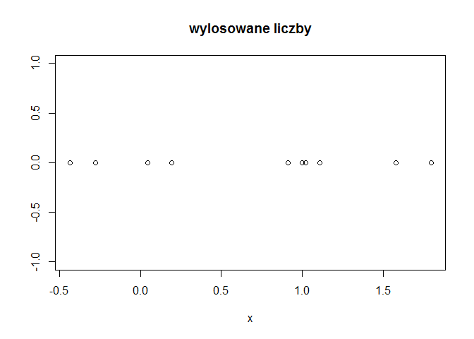

# Nagłówek
## Zmienne

## Losowanie
Za chwilę *wylosuję* **10** liczb i obliczę ich średnią.
[Plotek](http://www.plotek.pl)


```r
set.seed(23)
x<-rnorm(n)
mean(x)
```

```
## [1] 0.6931617
```
1. *A*
2. **B**
3. C
3. D

- A
- B
- C
- D

Wykres
<!-- -->
